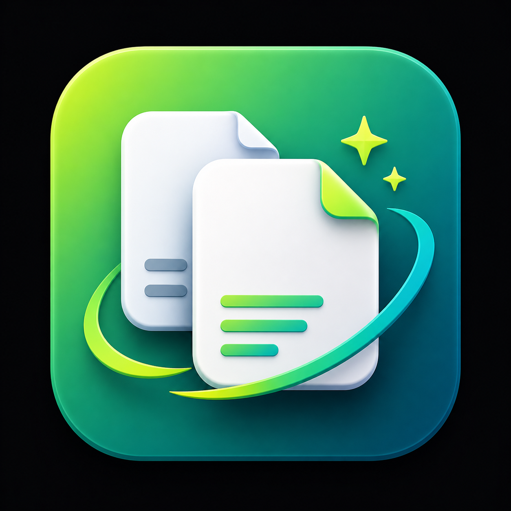

<h1 align="center">Duplicate File Finder Utility</h1>

  

  

<h2 align="center">Video Demo</h2>

  

  Full tutorial walkthrough on YouTube

  Lightweight offline macOS utility for finding, reviewing, organizing, and safely cleaning duplicate files.

---

<h2>Features</h2>

<ul>
<li>Scan folders locally for duplicate files</li>
<li>Automatically groups matching duplicates</li>
<li>Protects one original file in every duplicate group</li>
<li>Safety Mode preview before real file changes</li>
<li>Move duplicate copies to:
  <ul>
    <li>Safe Folder</li>
    <li>System Trash</li>
  </ul>
</li>
<li>Activity History tracking</li>
<li>Dark / Light mode</li>
<li>Sort by:
  <ul>
    <li>Status</li>
    <li>Filename</li>
    <li>File Size</li>
    <li>Duplicate Group</li>
  </ul>
</li>
<li>Right-click support to reveal files in Finder</li>
<li>Fully offline — nothing uploaded anywhere</li>
</ul>

---

<h2>Step-by-Step Usage</h2>

<ol>
<li>Select a folder to scan</li>
<li>Click <b>Scan Folder</b></li>
<li>Review duplicate groups in the preview table</li>
<li>Double-click files to ignore specific copies</li>
<li>Keep Safety Mode enabled to preview actions safely</li>
<li>Move duplicates to:
  <ul>
    <li>Safe Folder</li>
    <li>System Trash</li>
  </ul>
</li>
<li>Turn OFF Safety Mode only when ready for real file changes</li>
<li>Review Activity History to see what changed</li>
</ol>

---

<h2>Safety First</h2>

<ul>
<li>Originals are protected automatically</li>
<li>Safety Mode is enabled by default</li>
<li>Preview actions before making real changes</li>
<li>Trash actions remain recoverable through macOS Trash</li>
</ul>

---

<h2>Screenshots</h2>

<h3>Light Mode</h3>

  

---

<h3>Dark Mode</h3>

  

---

<h3>Scan Results Preview</h3>

  

---

<h3>Safety Mode Enabled</h3>

  

---

<h3>Preview Move to Safe Folder</h3>

  

---

<h3>Preview Move to Trash</h3>

  

---

<h3>Real Move to Safe Folder</h3>

  

---

<h3>Real Move to Trash</h3>

  

---

<h3>Files Moved to Safe Folder</h3>

  

---

<h3>Duplicate Files Sent to Trash</h3>

  

---

<h2>Download</h2>

<h3>Gumroad</h3>

<a href="https://gallonlabs.gumroad.com/l/duplicate-file-finder-utility">
https://gallonlabs.gumroad.com/l/duplicate-file-finder-utility
</a>

<h3>itch.io</h3>

<a href="https://automatorlabs.itch.io/duplicate-file-finder-utility">
https://automatorlabs.itch.io/duplicate-file-finder-utility
</a>

---

<h2>Privacy</h2>

Everything runs locally on your computer.

No uploads. 
No tracking. 
No cloud processing.

---

<h2>System Requirements</h2>

<ul>
<li>macOS</li>
<li>Apple Silicon or Intel Mac</li>
<li>No internet required</li>
</ul>
